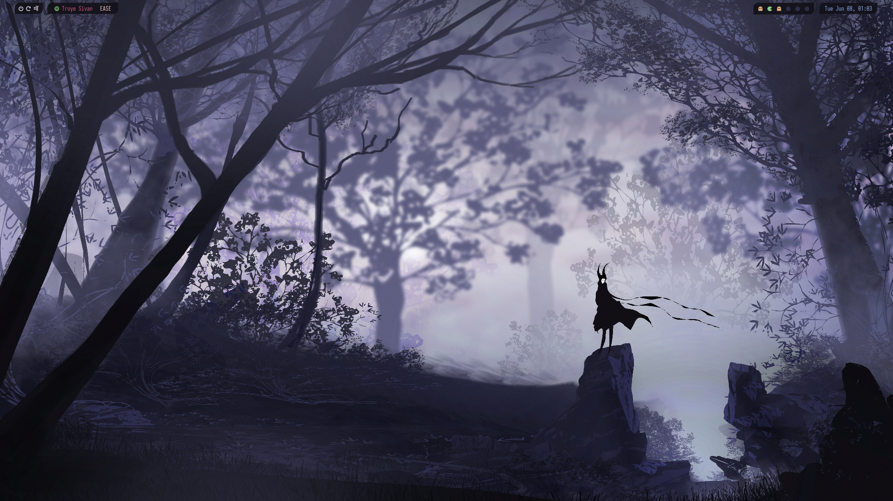
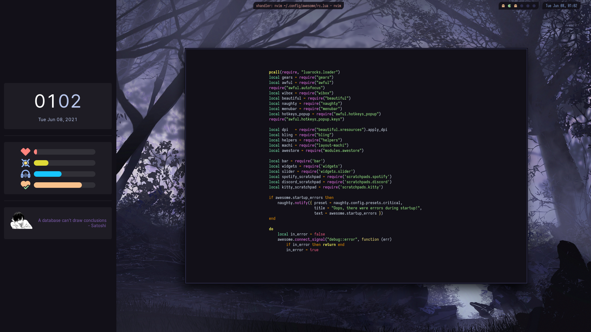
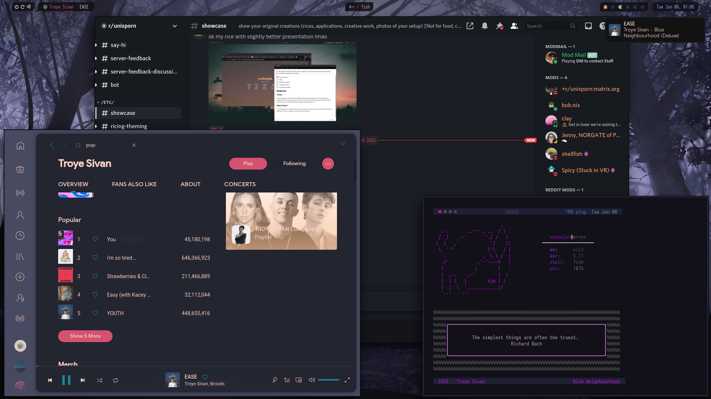
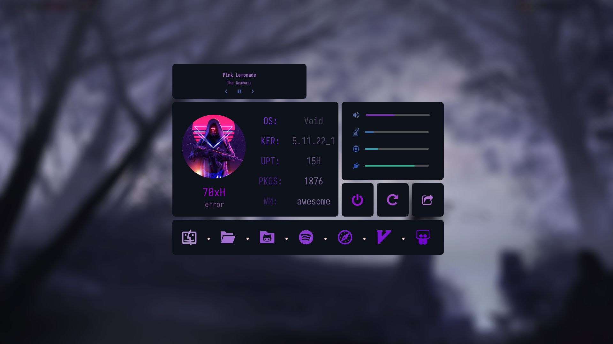

# ~/home/xhandler/.dotfiles

This is a home stitched out of many other homes, hope you enjoy your stay!!

## Screenshots

### Defacto

### Swoop

### Kat-OH

### Scratchpads

### EWW

## Configuration

* OS: Void Linux
* WM: awesome
* Terminal: kitty
* Shell: fish with starship
* Editor: Neovim
* Music: Spotify with Spicetify
* Misc: Discord
* EWW
* Bling
* awestore

### Inspirations and References

* [JavaCafe01](https://github.com/JavaCafe01/awedots)
* [elenapan](https://github.com/elenapan/dotfiles)
